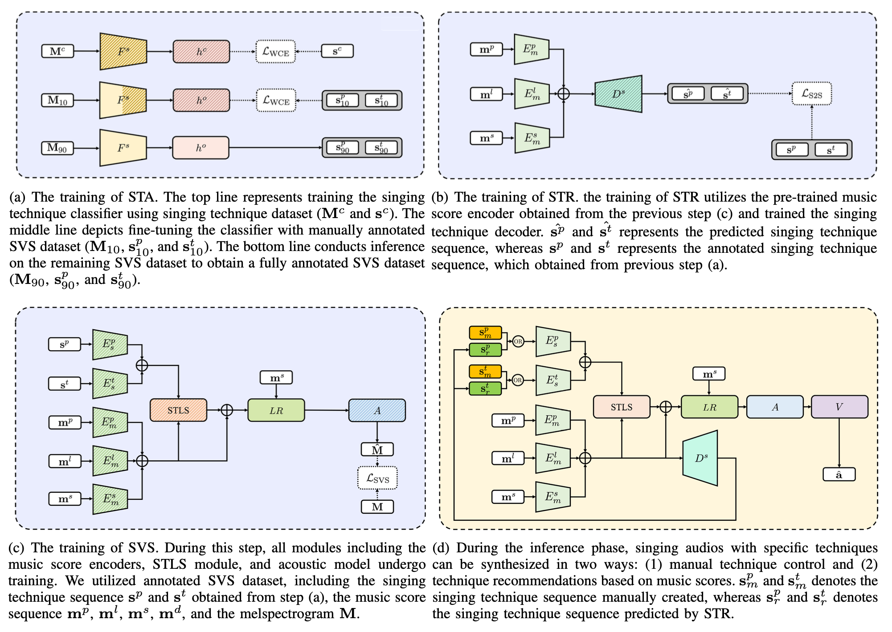
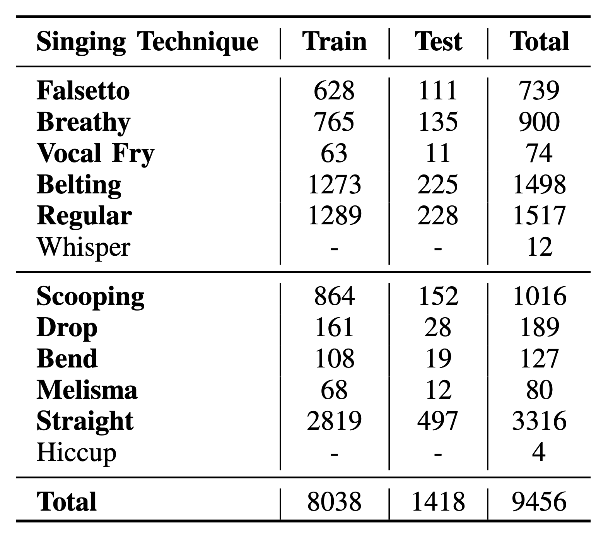
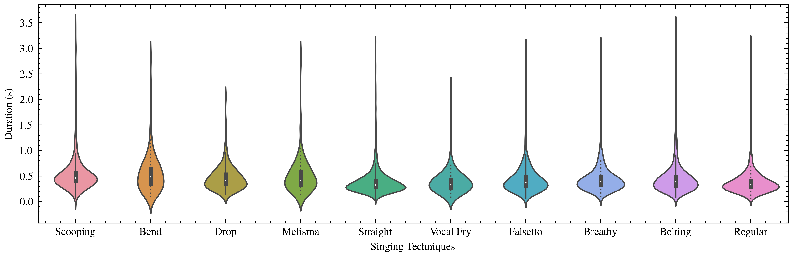

# SinTechSVS: A Singing Technique Controllable Singing Voice Synthesis System
## Junchuan Zhao, Low Qi Hong Chetwin, Ye Wang

### Abstract of the paper

<div style="text-align: justify">
    The precise control of singing techniques is of utmost importance in achieving emotionally expressive vocal performances. To bridge the gap between current Singing Voice Synthesis (SVS) systems and human singers, our paper focuses on developing an SVS system that allows for control over singing techniques. 
    In this paper, we introduce SinTechSVS, a singing technique controllable SVS system composed of a singing technique annotator, a singing technique controllable synthesizer, and a singing technique recommender. Our approach leverages transfer learning for efficient singing technique annotation and adapts the DiffSinger framework with additional style encoders and an attention-based singing technique local score (STLS) module to enhance singing technique controllability. 
    We also propose a Seq2Seq singing technique recommender for the new task of Singing Technique Recommendation (STR). 
    Experimental results demonstrate that SinTechSVS significantly improves the quality and expressiveness of synthesized vocal performances, with comparable general synthesis capabilities to state-of-the-art SVS systems and enhanced control over singing techniques, as evidenced by objective and subjective evaluations. To the best of our knowledge, SinTechSVS is the first SVS capable of controlling singing techniques. 
</div>

<!-- ### 
We provide the annotation of the dataset and its detail on the appendix website (this site). https://yamathcy.github.io/ISMIR2022J-POP/ 
``` -->

### Overall Architecture

<div style="text-align: center;">
    
</div>

<div style="text-align: justify">
    SinTechSVS consists of three key components: singing technique annotator (STA), singing voice synthesizer conditioned on singing techniques (SVS), and singing technique recommender (STR). The 'OR' symbol in this figure means that the input of SVS is either by a user-input singing technique sequence or the predicted singing technique sequence from the singing technique recommender. 
</div>

<br>
<div style="text-align: center;">
    
</div>

<div style="text-align: justify">
    The training process of SinTechSVS consists of three steps, with each step laying the foundation for the next. Modules depicted with full shadows remain unfixed during the training step, while those with half shadows are first fixed and then unfixed during training. (Top-left): Training of STA; (Bottom-left): Training of STA; (Bottom-right): Inference of SinTechSVS.
</div>

### Singing Techniques
<div style="text-align: justify">
    In this section, we provide samples of singing techniques included in our research. In sentence-level samples, bolded words are sung in the specific technique.
</div>

<table>
    <thead>
        <tr>
            <th colspan="4">Singing Voice Samples of Pitch Singing Techniques</th>
        </tr>
    </thead>
    <tbody>
        <tr>
            <td><center>Pitch Singing Techniques</center></td>
            <td><center>Word-level Sample 1</center></td>
            <td><center>Word-level Sample 2</center></td>
            <td><center>Sentence-level Sample</center></td>
        </tr>
        <tr>
            <td>Scooping</td>
            <td>
                <audio controls>
                  <source src="2002000053_7_scooping.wav" type="audio/mpeg">
                  Your browser does not support the audio tag.
                </audio>
            </td>
            <td>
                <audio controls>
                  <source src="2001000020_11_scooping.wav" type="audio/mpeg">
                  Your browser does not support the audio tag.
                </audio>
            </td>
            <td>
                <center>
                    <span style="text-decoration: underline; font-weight: bold; color: red;">具(ju)</span> 象(xiang)
                </center>
                <audio controls>
                  <source src="2031001168_ju_scooping.wav" type="audio/mpeg">
                  Your browser does not support the audio tag.
                </audio>
            </td>
        </tr>
        <tr>
            <td>Bend</td>
            <td>
                <audio controls>
                  <source src="2002000066_0_bend.wav" type="audio/mpeg">
                  Your browser does not support the audio tag.
                </audio>
            </td>
            <td>
                <audio controls>
                  <source src="2002000066_11_bend.wav" type="audio/mpeg">
                  Your browser does not support the audio tag.
                </audio>
            </td>
            <td>
                <center>
                    没(mei) 限(xian) <span style="text-decoration: underline; font-weight: bold; color: red;">期(qi)</span>
                </center>
                <audio controls>
                  <source src="2042001596_qi_bend.wav" type="audio/mpeg">
                  Your browser does not support the audio tag.
                </audio>
            </td>
        </tr>
        <tr>
            <td>Drop</td>
            <td>
                <audio controls>
                  <source src="2002000071_3_drop.wav" type="audio/mpeg">
                  Your browser does not support the audio tag.
                </audio>
            </td>
            <td>
                <audio controls>
                  <source src="2007000218_6_drop.wav" type="audio/mpeg">
                  Your browser does not support the audio tag.
                </audio>
            </td>
            <td>
                <center>
                    再(zai) <span style="text-decoration: underline; font-weight: bold; color: red;">给(gei)</span> 我(wo) 两(liang) 分(fen) 钟(zhong)
                </center>
                <audio controls>
                  <source src="2067002490_gei_drop.wav" type="audio/mpeg">
                  Your browser does not support the audio tag.
                </audio>
            </td>
        </tr>
        <tr>
            <td>Melisma</td>
            <td>
                <audio controls>
                  <source src="2057002127_3_melisma.wav" type="audio/mpeg">
                  Your browser does not support the audio tag.
                </audio>
            </td>
            <td>
                <audio controls>
                  <source src="2010000384_4_melisma.wav" type="audio/mpeg">
                  Your browser does not support the audio tag.
                </audio>
            </td>
            <td>
                <center>
                    <span style="text-decoration: underline; font-weight: bold; color: red;">双(shuang)</span> 眼(yan)
                </center>
                <audio controls>
                  <source src="2017000662_shuang_melisma.wav" type="audio/mpeg">
                  Your browser does not support the audio tag.
                </audio>
            </td>
        </tr>
    </tbody>
    <thead>
        <tr>
            <th colspan="4">Singing Voice Samples of Timbre Singing Techniques</th>
        </tr>
    </thead>
    <tbody>
        <tr>
            <td>Vocal Fry</td>
            <td>
                <audio controls>
                  <source src="2001000009_0_vf.wav" type="audio/mpeg">
                  Your browser does not support the audio tag.
                </audio>
            </td>
            <td>
                <audio controls>
                  <source src="2004000113_2_vf.wav" type="audio/mpeg">
                  Your browser does not support the audio tag.
                </audio>
            </td>
            <td>
                <center>
                    <span style="text-decoration: underline; font-weight: bold; color: red;">我(wo)</span> 们(men) 都(dou) 需(xu) 要(yao) 勇(yong) 气(qi)
                </center>
                <audio controls>
                  <source src="2028001094_wo_vf.wav" type="audio/mpeg">
                  Your browser does not support the audio tag.
                </audio>
            </td>
        </tr>
        <tr>
            <td>Falsetto</td>
            <td>
                <audio controls>
                  <source src="2047001800_5_fal.wav" type="audio/mpeg">
                  Your browser does not support the audio tag.
                </audio>
            </td>
            <td>
                <audio controls>
                  <source src="2047001802_6_fal.wav" type="audio/mpeg">
                  Your browser does not support the audio tag.
                </audio>
            </td>
            <td>
                <center>
                    没(mei) 
                    <span style="text-decoration: underline; font-weight: bold; color: red;">有(wo) 你(you) 根(gen) 本(ben)</span> 不(bu) 想(xiang) 逃(tao)
                </center>
                <audio controls>
                  <source src="falsetto.wav" type="audio/mpeg">
                  Your browser does not support the audio tag.
                </audio>
            </td>
        </tr>
        <tr>
            <td>Breathy</td>
            <td>
                <audio controls>
                  <source src="2050001901_5_breathy.wav" type="audio/mpeg">
                  Your browser does not support the audio tag.
                </audio>
            </td>
            <td>
                <audio controls>
                  <source src="2053001995_0_breathy.wav" type="audio/mpeg">
                  Your browser does not support the audio tag.
                </audio>
            </td>
            <td>
                <center>
                    我(wo) 
                    <span style="text-decoration: underline; font-weight: bold; color: red;">不(bu) 会(hui) 发(fa) 现(xian) 我(wo) 难(nan) 受(shou)</span>
                </center>
                <audio controls>
                  <source src="2094003485_all_except_first_breathy.wav" type="audio/mpeg">
                  Your browser does not support the audio tag.
                </audio>
            </td>
        </tr>
        <tr>
            <td>Belting</td>
            <td>
                <audio controls>
                  <source src="2054002011_3_belting.wav" type="audio/mpeg">
                  Your browser does not support the audio tag.
                </audio>
            </td>
            <td>
                <audio controls>
                  <source src="2057002140_13_belting.wav" type="audio/mpeg">
                  Your browser does not support the audio tag.
                </audio>
            </td>
            <td>
                <center>
                    <span style="text-decoration: underline; font-weight: bold; color: red;">一(yi) 辈(bei) 子(zi) 暖(nuan) 暖(nuan) 的(de) 好(hao)</span>
                </center>
                <audio controls>
                  <source src="2093003482_all_belting.wav" type="audio/mpeg">
                  Your browser does not support the audio tag.
                </audio>
            </td>
        </tr>
    </tbody>
</table>

### Annotated Data Statistics
<div style="text-align: center;">
    
</div>

<div style="text-align: justify">
    Distribution of manually annotated portion of Opencpop dataset. The singing techniques ”whisper” and ”hiccup” are removed due to the small amount of labels.
</div>

<div style="text-align: center;">
    
</div>
<div style="text-align: justify">
    Distribution of duration of each singing technique.
</div>


### SinTechSVS Samples


### Contact
If you have any questions about the paper, please contact the first author Junchuan.
