# SinTechSVS: A Singing Technique Controllable Singing Voice Synthesis System
## Junchuan Zhao, Low Qi Hong Chetwin, Ye Wang

### Abstract of the paper

<div style="text-align: justify">
    The precise control of singing techniques is of utmost importance in achieving emotionally expressive vocal performances. To bridge the gap between current Singing Voice Synthesis (SVS) systems and human singers, our paper focuses on developing an SVS system that allows for control over singing techniques. 
    In this paper, we introduce SinTechSVS, a singing technique controllable SVS system composed of a singing technique annotator, a singing technique controllable synthesizer, and a singing technique recommender. Our approach leverages transfer learning for efficient singing technique annotation and adapts the DiffSinger framework with additional style encoders and an attention-based singing technique local score (STLS) module to enhance singing technique controllability. 
    We also propose a Seq2Seq singing technique recommender for the new task of Singing Technique Recommendation (STR). 
    Experimental results demonstrate that SinTechSVS significantly improves the quality and expressiveness of synthesized vocal performances, with comparable general synthesis capabilities to state-of-the-art SVS systems and enhanced control over singing techniques, as evidenced by objective and subjective evaluations. To the best of our knowledge, SinTechSVS is the first SVS capable of controlling singing techniques. 
</div>

<!-- ### 
We provide the annotation of the dataset and its detail on the appendix website (this site). https://yamathcy.github.io/ISMIR2022J-POP/ 
``` -->

### Overall Architecture

<div style="text-align: center;">
    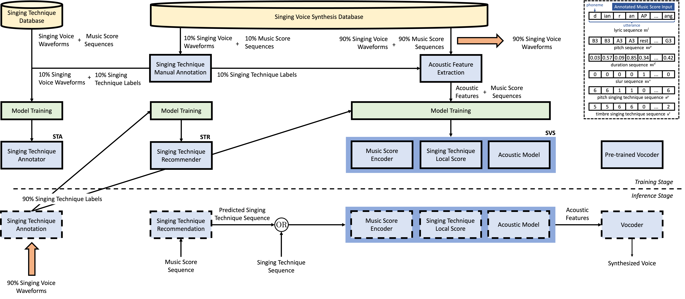
</div>

<div style="text-align: justify">
    SinTechSVS consists of three key components: singing technique annotator (STA), singing voice synthesizer conditioned on singing techniques (SVS), and singing technique recommender (STR). The 'OR' symbol in this figure means that the input of SVS is either by a user-input singing technique sequence or the predicted singing technique sequence from the singing technique recommender. 
</div>

### Singing Techniques
<div style="text-align: justify">
    In this section, we provide samples of singing techniques included in our research.
</div>

<table align="center" style="width:100%; border:#000 solid; border-width:1px 0">
    <thead>
        <tr>
            <th colspan="3">Singing Voice Samples of Pitch Singing Techniques</th>
        </tr>
    </thead>
    <tbody>
        <tr>
            <td>Scooping</td>
            <td><audio src="2002000053_7_scooping.wav"></td>
            <td><audio src="2002000053_7_scooping.wav"></td>
        </tr>
        <tr>
            <td>Scooping</td>
            <td><audio src="2002000053_7_scooping.wav"></td>
            <td><audio src="2002000053_7_scooping.wav"></td>
        </tr>
    </tbody>
    <thead>
        <tr>
            <th colspan="3">Singing Voice Samples of Timbre Singing Techniques</th>
        </tr>
    </thead>
    <tbody>
        <tr>
            <td>Scooping</td>
            <td><audio src="2002000053_7_scooping.wav"></td>
            <td><audio src="2002000053_7_scooping.wav"></td>
        </tr>
        <tr>
            <td>Scooping</td>
            <td><audio src="2002000053_7_scooping.wav"></td>
            <td><audio src="2002000053_7_scooping.wav"></td>
        </tr>
    </tbody>
</table>


#### Metadata
It contains songlist. it contains following information;
<iframe width="1000" height="500" src="https://docs.google.com/spreadsheets/d/e/2PACX-1vRAkgcnUAJkbBLqnpvs2qk9uAdqkVyjygsI7wvrBC4zrpKhc_lVTIR0xTm5Yk6I-aFt1O5DQqxVITj1/pubhtml?gid=1530300283&amp;single=true&amp;widget=true&amp;headers=false"></iframe>

#### Annotations
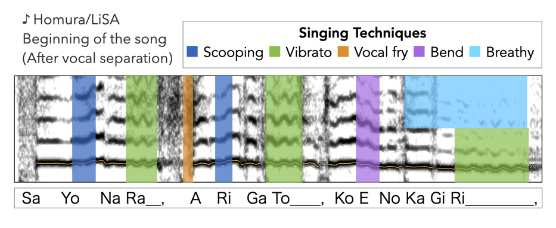

- **Singing techniques**: Overlapping strong labeled annotation (i.e. kinds and timestamps) of singing techniques.
<p style="color:red;"><b>(CAUTION) Audio files are not contained below!!</b></p>
 
-> If you want the annotation files, access [here](https://drive.google.com/file/d/1o4TTd7Xeog5oVBiVuolckQM1vg0Z0Ldd/view?usp=share_link) and request a permission. 
The annotation is research purpose only.

The request should include the following. Otherwise it will be rejected.
  - Name
  - Affiliation
  - Email Address
  - Agree to the [License](#license)


<br>

- **Pitch (not publicly available)**: Since pitch is an essential component of singing technique analysis, we further annotated melodic pitch using [Tony](https://www.sonicvisualiser.org/tony/), followed by manual correction such as removing the unvoiced parts and reverberation tails.


**Because of copyright issue, we don't provide raw audio tracks.** Instead, we provide links of music streaming service for each songs in COSIAN.

- **Spotify links**: Because of copyright issue, we don't provide raw audio tracks. Instead, we provide Spotify links of each songs in COSIAN.

- **YouTube links**: We also provides YouTube links on the YouTube playlist. Note that the playlist only contains official mv without alignment information. 

- **Amazon music links** (work in progress): We will also provides Amazon music links for you to purchase CD recordings, which we actually used in the task.

- **Apple music links** : In addition to Amazon music, we also provide Apple music links. When purchasing each music track via Apple music, please purchase them from the "apple_music" column in the spreadsheet.


### Annotation procedure
We used [Sonic visualiser](https://www.sonicvisualiser.org/), to annotate the singing techniques with both of the help of sound playback and visualizing the spectrograms and pitchgrams.
<div style="text-align: center;">
    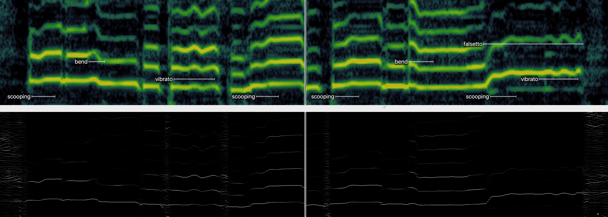
</div>


### Annotated singing techniques

Overview
<div style="text-align: center;">
    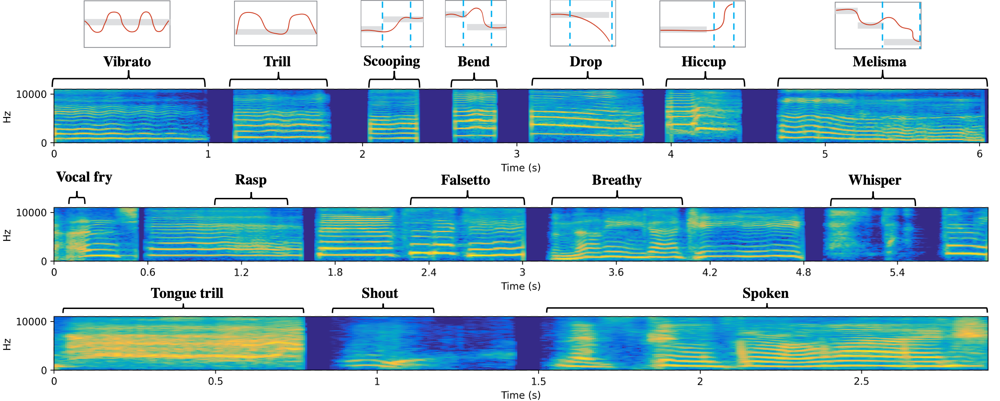
</div>
<div style="text-align: center;">
    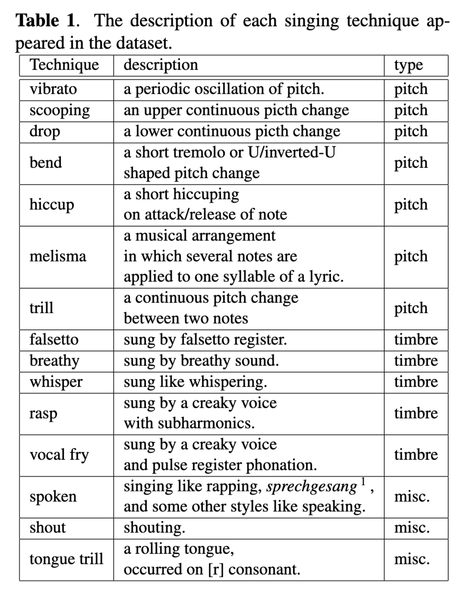
</div>

#### Examples of each singing technique
<div style="text-align: center;">
    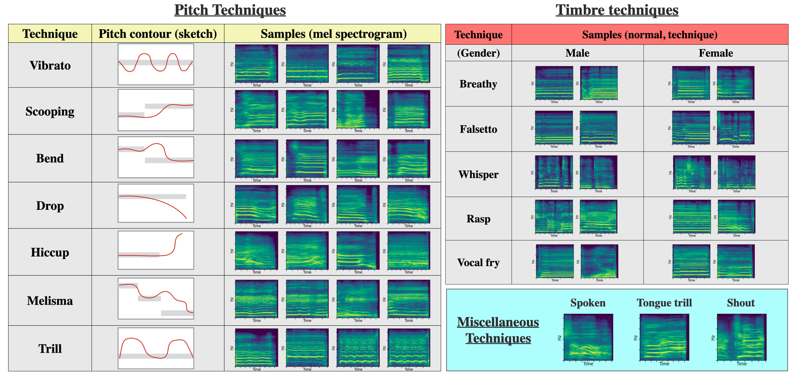
</div>


### Data statistics 
- Annotated duration
<div style="text-align: center;">
    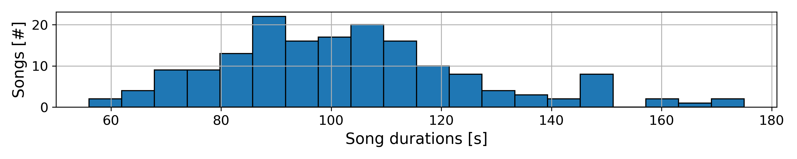
</div>

- Song released year
<div style="text-align: center;">
    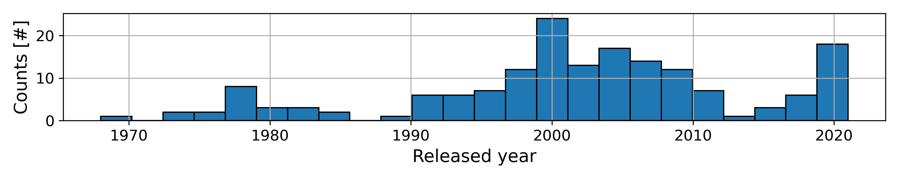
</div>

- Count and duration of singing techniques
<div style="text-align: center;">
    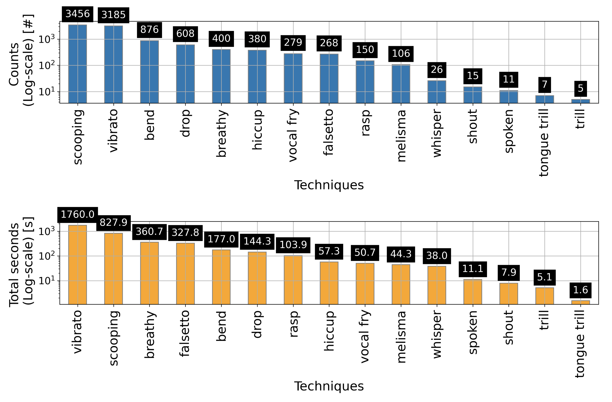
</div>

- Distribution of duration of each singing technique
<div style="text-align: center;">
    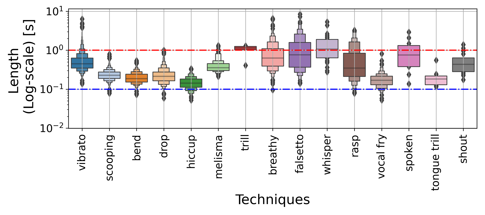
</div>

- Singer-wise count of singing techniques
<div style="text-align: center;">
    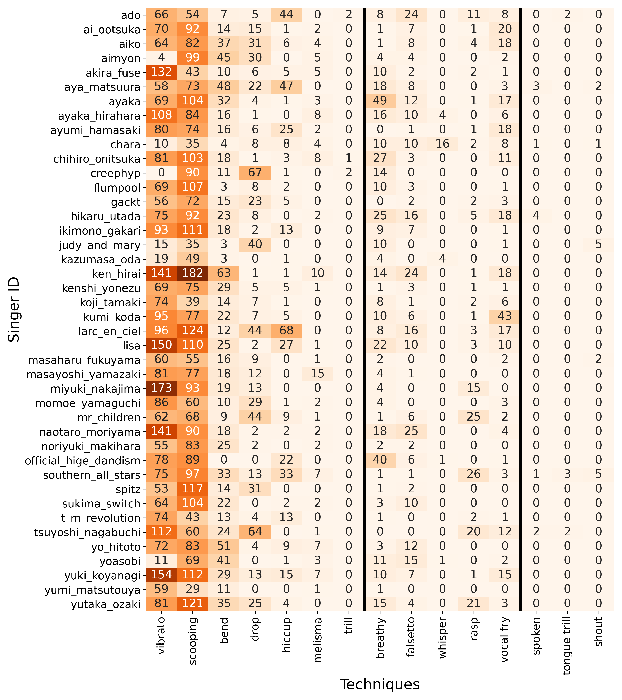
</div>

### Detected examples
These are the examples automatically detected by Focal-GT model. 
**Note that videos are sample of audio clip, we actually used audio from the CD recordings for the task.**
<div style="text-align: center;">
    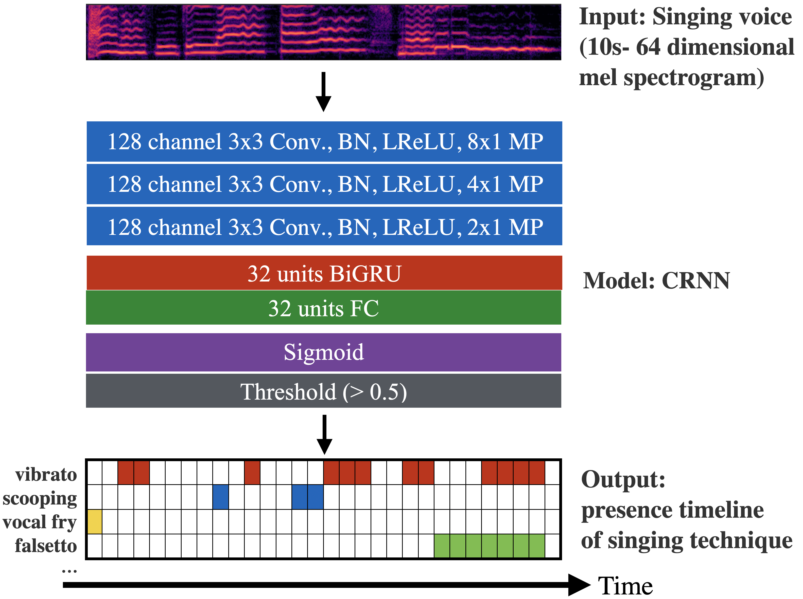
    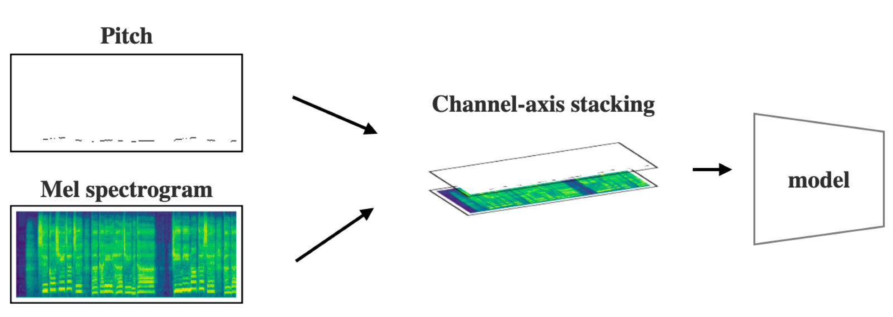
</div>

#### Good examples

<table>
    <thead>
        <tr>
            <th colspan="2">#1: Sakura / Ikimono gakari</th>
        </tr>
    </thead>
    <tbody>
      <tr>
            <td>Video clip 1:30-1:36</td>
            <td>Label (Upper: ground truth label, lower: detected labels)</td>
        </tr>
        <tr>
            <td><iframe width="400" height="300" src="https://www.youtube.com/embed/61z-cqg28R8?start=90" title="YouTube video player" frameborder="0" allow="accelerometer; autoplay; clipboard-write; encrypted-media; gyroscope; picture-in-picture" allowfullscreen></iframe></td>
            <td>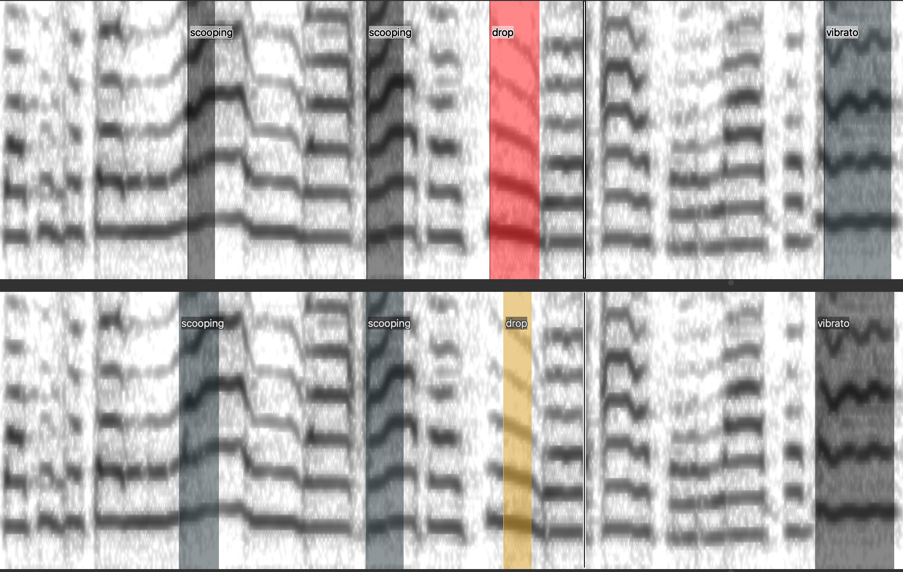</td>
        </tr>
    </tbody>
</table>

<table>
    <thead>
        <tr>
            <th colspan="2">#2: Omoiga karanaru sono mae ni / Ken Hirai</th>
        </tr>
    </thead>
    <tbody>
      <tr>
            <td>Video clip 2:38-2:45</td>
            <td>Label (Upper: ground truth label, lower: detected labels)</td>
        </tr>
        <tr>
            <td><iframe width="400" height="300" src="https://www.youtube.com/embed/n2zqrJMuJvM?start=158" title="YouTube video player" frameborder="0" allow="accelerometer; autoplay; clipboard-write; encrypted-media; gyroscope; picture-in-picture" allowfullscreen></iframe>
</td>
            <td><div style="text-align: left;">
    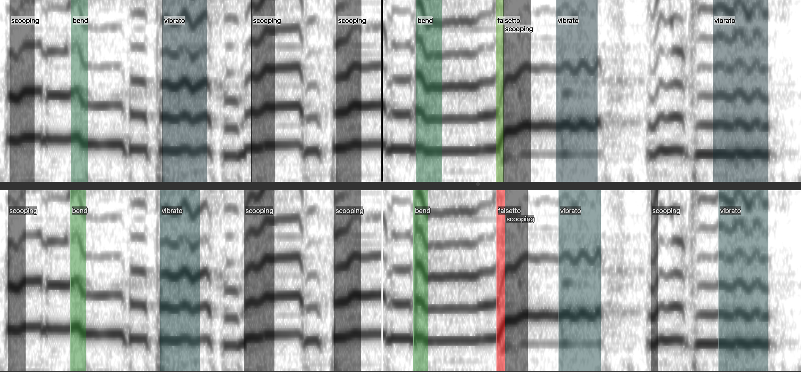
</div></td>
        </tr>
    </tbody>
</table>

#### Bad examples

We confirmed that one of the common mis-detection cases is from the detection of too short or frequently switching regions.


<table>
    <thead>
        <tr>
            <th colspan="2">#1: Readymade / Ado</th>
        </tr>
    </thead>
    <tbody>
      <tr>
            <td>Video clip 0:50-0:55</td>
            <td>Label (Upper: ground truth label, lower: detected labels)</td>
        </tr>
        <tr>
            <td><iframe width="400" height="300" src="https://www.youtube.com/embed/jg09lNupc1s?start=50" title="YouTube video player" frameborder="0" allow="accelerometer; autoplay; clipboard-write; encrypted-media; gyroscope; picture-in-picture" allowfullscreen></iframe></td>
            <td>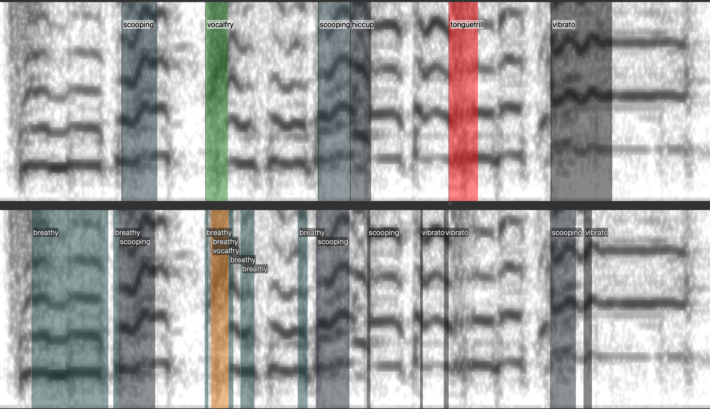</td>
        </tr>
    </tbody>
</table>

<table>
    <thead>
        <tr>
            <th colspan="2">#2: Honey / L'Arc～en～Ciel</th>
        </tr>
    </thead>
    <tbody>
      <tr>
            <td>Video clip 0:14-0:20</td>
            <td>Label (Upper: ground truth label, lower: detected labels)</td>
        </tr>
        <tr>
            <td>
            <iframe width="400" height="300" src="https://www.youtube.com/embed/WmM-KTcG3QY?start=14" title="YouTube video player" frameborder="0" allow="accelerometer; autoplay; clipboard-write; encrypted-media; gyroscope; picture-in-picture" allowfullscreen></iframe></td>
            <td>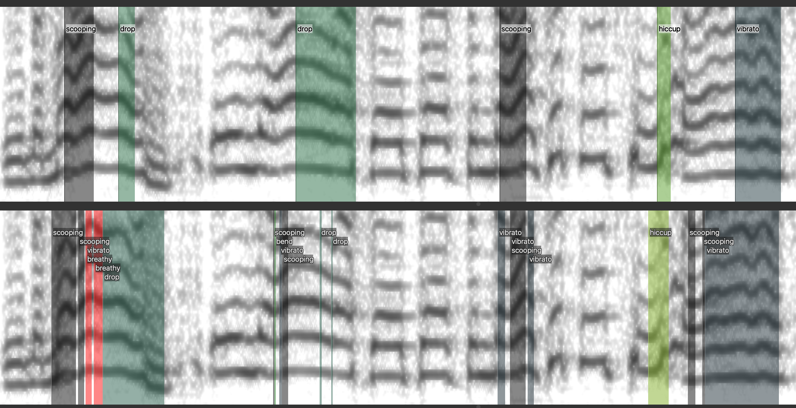</td>
        </tr>
    </tbody>
</table>

### Contact
If you have any questions about the paper, please contact the first author Junchuan.
